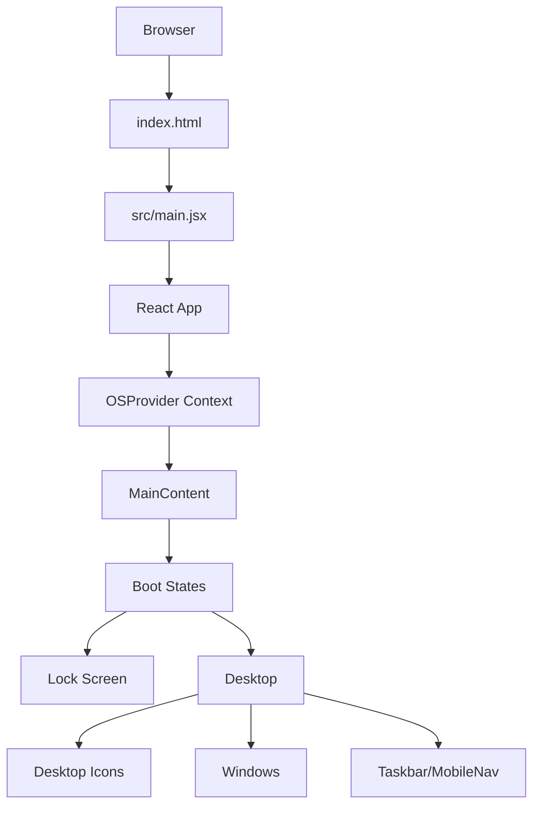
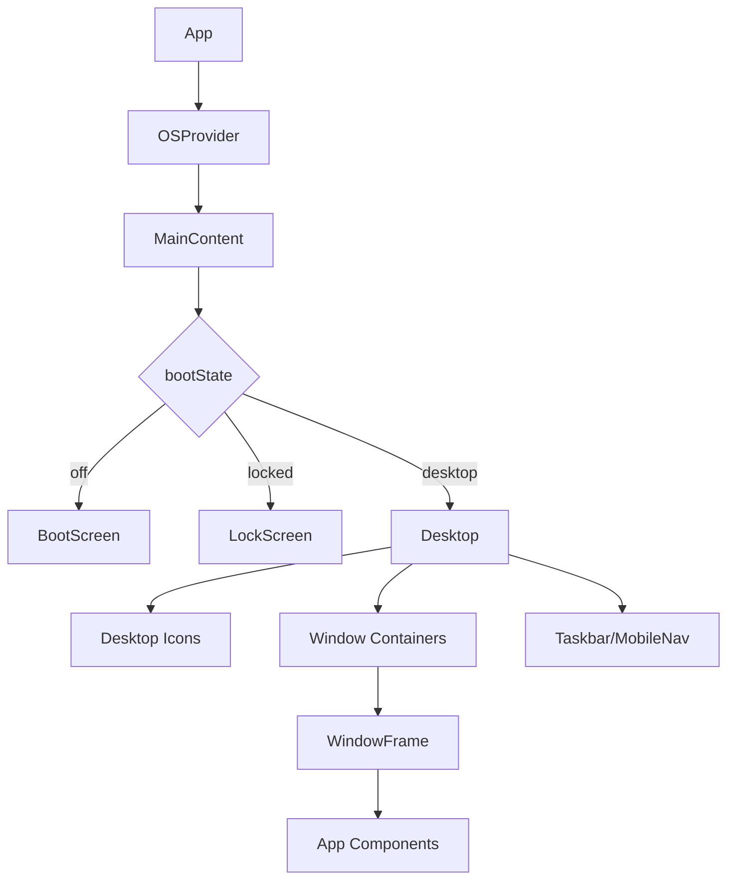
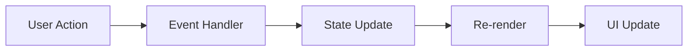

# CherryOS Architecture Documentation

This document provides a comprehensive overview of the CherryOS system architecture, design principles, and implementation details.

## Table of Contents

1. [Overview](#overview)
2. [System Architecture](#system-architecture)
3. [Core Components](#core-components)
4. [State Management](#state-management)
5. [Component Hierarchy](#component-hierarchy)
6. [Data Flow](#data-flow)
7. [Design Patterns](#design-patterns)
8. [Performance Considerations](#performance-considerations)
9. [Extensibility](#extensibility)
10. [Security Considerations](#security-considerations)

## Overview

CherryOS is a React-based web application that simulates a desktop operating system environment. It provides an interactive portfolio experience with multiple applications contained within draggable windows.

Key architectural principles:

- Single Page Application (SPA)
- Component-based architecture
- Context API for state management
- Mobile-responsive design
- Progressive enhancement

## System Architecture

### High-Level Architecture



### Technology Stack

- **Frontend Framework**: React 19
- **Build Tool**: Vite 7
- **Styling**: Tailwind CSS 4 (with `@tailwindcss/vite`)
- **Icons**: Lucide React
- **State Management**: React Context API (`src/context/OSContext.jsx`)
- **Deployment**: Static hosting (GitHub Pages–compatible with `base: '/CherryOS/'`)

### Source Layout (Modular Architecture)

| Directory | Purpose |
|-----------|--------|
| `src/apps/` | **Application modules** — one component per app (TerminalApp, MySongsApp, WatchLogApp, GameCenterApp, StudioRackApp). All app logic is isolated here; Desktop imports them via `React.lazy`. |
| `src/components/` | **Shell UI** — BootScreen, LockScreen, Desktop, DesktopIcon, WindowFrame, Taskbar, MobileNav. No app business logic. |
| `src/context/` | **Global state** — OSContext (boot state, windows, openWindow, etc.). |
| `src/hooks/` | **Reusable hooks** — e.g. useDraggable, useTime (see `useOSHooks.js`). |
| `src/data/` | **Static data** — constants, plugin lists, etc. |
| `src/test/` | **Unit and E2E tests** — Vitest + Playwright. |

**File renames / refactor (2.0.0):** The former monolithic `App.jsx` was split: app components moved into `src/apps/`, shell components remain in `src/components/`. Entry is still `src/main.jsx` → `App.jsx` (which composes OSProvider and MainContent).

## Core Components

### OSProvider

The central context provider that manages the entire OS state.

**Responsibilities:**

- Managing boot state (off, locked, desktop)
- Window management (open, close, minimize, focus)
- Mobile detection
- Providing OS functions to child components

### MainContent

Conditional renderer that displays the appropriate screen based on boot state.

### BootScreen

Displays the boot sequence with progress indicator.

### LockScreen

Shows the lock screen with background image and unlock interaction.

### Desktop

Main desktop environment containing:

- Desktop icons for applications
- Window containers
- Taskbar or MobileNav

### WindowFrame

Container component for application windows with:

- Draggable functionality
- Minimize/close controls
- Title bar with icon
- Z-index management

### Taskbar

Desktop taskbar showing:

- Application launcher button
- Open window indicators
- System tray (WiFi, battery)
- Clock/time display

### MobileNav

Mobile-optimized navigation with:

- Lock screen button
- Application launcher
- Reset button

## State Management

### OS Context State

```javascript
{
  bootState: 'off'|'locked'|'desktop',
  windows: [
    {
      id: string,
      component: React.Component,
      title: string,
      icon: React.Component,
      props: object,
      minimized: boolean,
      zIndex: number,
      position: { x: number, y: number }
    }
  ],
  activeWindowId: string,
  isMobile: boolean
}
```

### Hook-Based State

Several custom hooks manage specific functionality:

1. **useDraggable**: Handles window dragging
2. **useTime**: Provides current time
3. **useOS**: Accesses OS context

### Data Structures

#### Applications Array

```javascript
[
  {
    id: 'unique-id',
    title: 'Display Name',
    icon: LucideIconComponent,
    component: React.Component
  }
]
```

#### Window Objects

```javascript
{
  id: 'app-id',
  component: AppComponent,
  title: 'Window Title',
  icon: IconComponent,
  props: {},
  minimized: false,
  zIndex: 1,
  position: { x: 50, y: 50 }
}
```

## Component Hierarchy



### Desktop Icons

Each desktop icon follows this structure:

```text
DesktopIcon
├── Icon Component (from Lucide React)
├── Label Text
└── Click Handler
```

### Application Components

Each application is a self-contained React component:

- TerminalApp
- MySongsApp
- WatchLogApp
- GameCenterApp
- StudioRackApp

## Data Flow

### Initialization Sequence

1. App mounts
2. OSProvider initializes state
3. BootScreen displays
4. Progress completes
5. LockScreen displays
6. User interaction unlocks desktop
7. Desktop environment loads

### Window Management Flow

1. User clicks desktop icon
2. openWindow function called
3. Window added to state
4. WindowFrame rendered
5. Window focused (brought to front)
6. User can drag, minimize, or close

### Event Handling



## Design Patterns

### Provider Pattern

Used for global state management:

```jsx
<OSProvider>
  <MainContent />
</OSProvider>
```

### Compound Component Pattern

WindowFrame and its contents work together:

```jsx
<WindowFrame window={windowConfig}>
  <AppComponent />
</WindowFrame>
```

### Custom Hook Pattern

Reusable logic encapsulated in hooks:

```jsx
const { position, handleMouseDown } = useDraggable(initialPosition);
```

### Render Props Pattern

Context values provided to children:

```jsx
<OSContext.Provider value={contextValue}>
  {children}
</OSContext.Provider>
```

## Performance Considerations

### Optimization Techniques

1. **Memoization**: React.memo for DesktopIcon, WindowFrame.
2. **Lazy Loading**: All app components in `src/apps/` are loaded via `React.lazy()` in Desktop.jsx; each window is wrapped in `Suspense` with a minimal skeleton fallback so LCP is not blocked.
3. **Event Delegation**: Efficient event handling; `touch-manipulation` and 44px min touch targets on mobile.
4. **Virtualization**: Potential for large lists (e.g. in apps).
5. **CSS Optimization**: Hardware-accelerated animations; Tailwind 4 with Vite plugin.

### Bundle Size

Current optimizations:

- Tree-shaking enabled via Vite 7
- Only necessary Lucide icons imported
- Code-split app chunks (each app in `src/apps/` is a separate chunk)
- Minimal external dependencies

### Rendering Performance

- Window components only render when needed
- Efficient state updates
- Proper cleanup of event listeners

## Extensibility

### Adding New Applications

1. Create a new component in **`src/apps/`** (e.g. `src/apps/MyNewApp.jsx`).
2. In **`src/components/Desktop.jsx`**: add `React.lazy(() => import('../apps/MyNewApp'))`, then add an entry to the `APPS` array with `id`, `title`, `icon`, and `component`.
3. Import the required icon from `lucide-react`.
4. Test on desktop and mobile (E2E covers Chromium, Firefox, WebKit, and mobile viewports).

### Customizing Existing Applications

Applications can be customized by:

- Modifying data structures
- Updating UI components
- Adding new features
- Changing styling

### Theme Customization

Tailwind CSS allows for:

- Easy color scheme changes
- Responsive design adjustments
- Component styling variations

## Security Considerations

### Client-Side Security

As a client-side application, security considerations include:

- No sensitive data processing
- Secure external API handling (if added)
- Proper input validation
- XSS prevention through React's built-in escaping

### Data Handling

Current implementation:

- All data is static/local (see `src/data/`).
- TerminalApp: user input is sanitized (length cap, control-char strip); never rendered via `dangerouslySetInnerHTML`. Telemetry URL is env-based (`VITE_TELEMETRY_URL`); response is validated before display.
- OSContext: `openWindow(appId, component, title, icon, initialProps)` — `title` and `initialProps` must be trusted or sanitized; they are rendered as text in WindowFrame or passed to app components. See [SECURITY_AUDIT.md](SECURITY_AUDIT.md).

### Future Security Enhancements

Potential improvements:

- Content Security Policy implementation
- Secure cookie handling (if server components added)
- Input sanitization for dynamic content
- Authentication/authorization (if needed)

## Accessibility

### Current Accessibility Features

- Semantic HTML structure
- Proper labeling of interactive elements
- Keyboard navigable components
- Sufficient color contrast
- ARIA attributes where appropriate

### Planned Accessibility Improvements

- Enhanced keyboard navigation
- Screen reader optimization
- Focus management improvements
- Reduced motion options

## Mobile Responsiveness

### Responsive Design Approach

- CSS media queries
- Flexible grid layouts
- Touch-friendly targets
- Adaptive component behavior

### Mobile-Specific Features

- MobileNav instead of Taskbar
- Full-screen windows
- Touch-optimized interactions
- Orientation awareness

## Future Architecture Improvements

### Future State Management

Consider upgrading to:

- Redux Toolkit for more complex state
- Zustand for simpler alternative
- Recoil for React-specific state management

### Performance Enhancements

- Code splitting for applications (each app in `src/apps/` lazy-loaded from Desktop).
- Suspense for loading states (skeleton fallback per window to avoid LCP regression).
- LCP target &lt; 2.0s (enforced in `src/test/e2e/performance.spec.js`).
- Web Workers for intensive operations (future).
- Service Workers for offline capability (PWA in roadmap).

### Feature Expansion

Potential additions:

- User preferences system
- Plugin architecture
- Marketplace for applications
- Theming engine
- Animation library integration

## Deployment Architecture

### Static Deployment

Optimized for:

- CDN distribution
- Edge computing
- Minimal server requirements
- High availability

### Scalability

Current architecture scales through:

- Client-side processing
- Stateless design
- Cacheable assets
- Minimal bandwidth requirements

## Monitoring and Analytics

### Current Capabilities

- Telemetry endpoint integration
- Performance monitoring potential
- User interaction tracking (opt-in)

### Future Monitoring

Potential additions:

- Error tracking integration
- Performance analytics
- User behavior insights
- Feature usage tracking

## Conclusion

CherryOS implements a modern React architecture with thoughtful consideration for performance, extensibility, and user experience. The component-based design allows for easy maintenance and expansion while the context-based state management provides efficient data flow throughout the application.

The architecture balances simplicity with functionality, making it accessible for developers to understand and extend while providing a rich, interactive experience for users.
