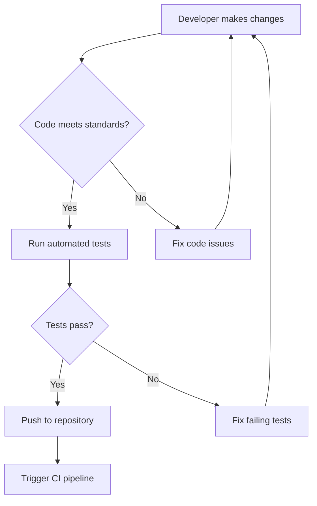
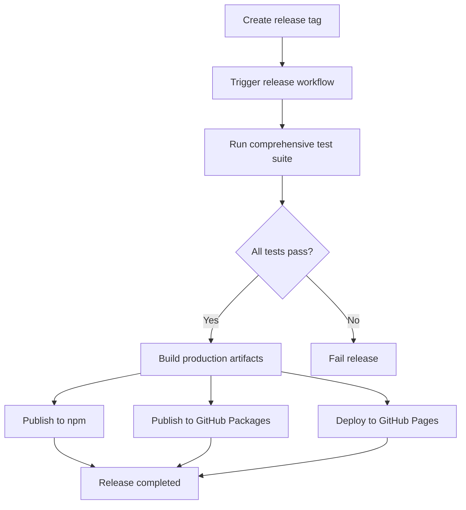

# CherryOS Automation Plan

This document outlines a comprehensive plan for automating project tasks in the CherryOS project. The plan covers automated workflows, task definitions, CI/CD pipeline improvements, testing automation strategies, and deployment automation approaches.

## Table of Contents

1. [Project Overview](#project-overview)
2. [Automated Workflows](#automated-workflows)
3. [Task Definitions](#task-definitions)
4. [CI/CD Pipeline Improvements](#cicd-pipeline-improvements)
5. [Testing Automation Strategies](#testing-automation-strategies)
6. [Deployment Automation Approaches](#deployment-automation-approaches)
7. [Implementation Roadmap](#implementation-roadmap)

## Project Overview

CherryOS is a React-based operating system interface built with modern web technologies:

- **Framework**: React 18 with Hooks
- **Build Tool**: Vite
- **Testing Framework**: Vitest with React Testing Library
- **Styling**: Tailwind CSS
- **Package Management**: npm
- **CI/CD**: GitHub Actions

Key configuration files:
- `package.json`: Project metadata and scripts
- `vite.config.js`: Vite build configuration
- `vitest.config.js`: Testing configuration
- `.github/workflows/`: GitHub Actions workflows

## Automated Workflows

### Development Workflow



### Release Workflow



## Task Definitions

### Core Development Tasks

1. **Development Server**
   ```bash
   npm run dev
   ```
   Starts the Vite development server with hot module replacement.

2. **Production Build**
   ```bash
   npm run build
   ```
   Creates an optimized production build in the `dist/` directory.

3. **Preview Production Build**
   ```bash
   npm run preview
   ```
   Locally previews the production build.

### Testing Tasks

1. **Run Tests**
   ```bash
   npm test
   ```
   Runs the Vitest test suite in watch mode.

2. **Run Tests with Coverage**
   ```bash
   npm run test:coverage
   ```
   Runs the test suite and generates coverage reports.

### Quality Assurance Tasks

1. **Linting** *(To be implemented)*
   ```bash
   npm run lint
   ```
   Checks code quality and style consistency.

2. **Type Checking** *(To be implemented)*
   ```bash
   npm run type-check
   ```
   Validates TypeScript type annotations.

3. **Security Audit**
   ```bash
   npm audit
   ```
   Checks for known security vulnerabilities in dependencies.

### Documentation Tasks

1. **Generate Documentation** *(To be implemented)*
   ```bash
   npm run docs:generate
   ```
   Generates project documentation from source code.

2. **Deploy Documentation** *(To be implemented)*
   ```bash
   npm run docs:deploy
   ```
   Deploys documentation to GitHub Pages or similar service.

## CI/CD Pipeline Improvements

### Current State Analysis

The project currently has two GitHub Actions workflows:

1. **ci-cd.yml**: Handles testing and deployment to GitHub Pages
2. **publish.yml**: Handles publishing to npm and GitHub Packages

### Proposed Enhancements

#### Enhanced CI Workflow (ci-cd.yml)

```yaml
name: CherryOS React CI/CD

on:
  push:
    branches: [ "main", "develop" ]
  pull_request:
    branches: [ "main" ]
  workflow_dispatch:

jobs:
  lint:
    runs-on: ubuntu-latest
    steps:
    - uses: actions/checkout@v4
    - name: Setup Node.js
      uses: actions/setup-node@v4
      with:
        node-version: '20'
        cache: 'npm'
    - name: Install dependencies
      run: npm ci
    - name: Run linter
      run: npm run lint  # To be added to package.json
      
  type-check:
    runs-on: ubuntu-latest
    steps:
    - uses: actions/checkout@v4
    - name: Setup Node.js
      uses: actions/setup-node@v4
      with:
        node-version: '20'
        cache: 'npm'
    - name: Install dependencies
      run: npm ci
    - name: Run type checking
      run: npm run type-check  # To be added to package.json
      
  test:
    runs-on: ubuntu-latest
    strategy:
      matrix:
        node-version: [18.x, 20.x]
    steps:
    - uses: actions/checkout@v4
    - name: Use Node.js ${{ matrix.node-version }}
      uses: actions/setup-node@v4
      with:
        node-version: ${{ matrix.node-version }}
        cache: 'npm'
    - name: Install dependencies
      run: npm ci
    - name: Run tests
      run: npm test
    - name: Run tests with coverage
      run: npm run test:coverage
    - name: Upload coverage to Codecov
      uses: codecov/codecov-action@v3
      with:
        file: ./coverage/lcov.info
        
  build:
    runs-on: ubuntu-latest
    needs: [lint, type-check, test]
    steps:
    - uses: actions/checkout@v4
    - name: Setup Node.js
      uses: actions/setup-node@v4
      with:
        node-version: '20'
        cache: 'npm'
    - name: Install dependencies
      run: npm ci
    - name: Build
      run: npm run build
    - name: Upload build artifacts
      uses: actions/upload-artifact@v3
      with:
        name: cherryos-build
        path: dist/
        
  deploy-preview:
    runs-on: ubuntu-latest
    needs: build
    if: github.event_name == 'pull_request'
    steps:
    - uses: actions/checkout@v4
    - name: Download build artifacts
      uses: actions/download-artifact@v3
      with:
        name: cherryos-build
        path: dist/
    - name: Deploy preview
      uses: rossjrw/pr-preview-action@v1
      with:
        source-dir: dist/
        
  deploy:
    needs: build
    if: github.ref == 'refs/heads/main'
    runs-on: ubuntu-latest
    steps:
    - uses: actions/checkout@v4
    - name: Download build artifacts
      uses: actions/download-artifact@v3
      with:
        name: cherryos-build
        path: dist/
    - name: Deploy to GitHub Pages
      uses: peaceiris/actions-gh-pages@v4
      with:
        github_token: ${{ secrets.GITHUB_TOKEN }}
        publish_dir: ./dist
```

#### Enhanced Release Workflow (release.yml)

```yaml
name: Release CherryOS

on:
  release:
    types: [published]
  workflow_dispatch:
    inputs:
      version:
        description: 'Version to release'
        required: true
        type: string

jobs:
  build:
    runs-on: ubuntu-latest
    steps:
    - uses: actions/checkout@v4
    - uses: actions/setup-node@v4
      with:
        node-version: 20
        cache: 'npm'
    - run: npm ci
    - run: npm test
    - run: npm run build
    
  publish-npm:
    needs: build
    runs-on: ubuntu-latest
    steps:
    - uses: actions/checkout@v4
    - uses: actions/setup-node@v4
      with:
        node-version: 20
        registry-url: https://registry.npmjs.org/
    - run: npm ci
    - run: npm publish
      env:
        NODE_AUTH_TOKEN: ${{ secrets.NPM_TOKEN }}
        
  publish-gpr:
    needs: build
    runs-on: ubuntu-latest
    permissions:
      contents: read
      packages: write
    steps:
    - uses: actions/checkout@v4
    - uses: actions/setup-node@v4
      with:
        node-version: 20
        registry-url: https://npm.pkg.github.com/
    - run: npm ci
    - run: npm publish
      env:
        NODE_AUTH_TOKEN: ${{ secrets.GITHUB_TOKEN }}
        
  deploy-docs:
    needs: build
    runs-on: ubuntu-latest
    steps:
    - uses: actions/checkout@v4
    - name: Setup Node.js
      uses: actions/setup-node@v4
      with:
        node-version: 20
    - run: npm ci
    - run: npm run docs:generate  # To be implemented
    - name: Deploy docs
      uses: peaceiris/actions-gh-pages@v4
      with:
        github_token: ${{ secrets.GITHUB_TOKEN }}
        publish_dir: ./docs-dist
        destination_dir: docs
```

## Testing Automation Strategies

### Current Testing Setup

The project currently uses Vitest with React Testing Library for testing, with the following configuration:

- Environment: jsdom
- Setup file: `./src/test/setup.js`
- Coverage provider: v8
- Reporters: text, json, html

### Proposed Testing Enhancements

#### 1. Test Organization

```
src/
├── components/
│   ├── __tests__/
│   │   ├── DesktopIcon.test.jsx
│   │   └── Window.test.jsx
│   └── DesktopIcon.jsx
├── hooks/
│   ├── __tests__/
│   │   └── useWindowManager.test.js
│   └── useWindowManager.js
├── utils/
│   ├── __tests__/
│   │   └── formatTime.test.js
│   └── formatTime.js
└── test/
    ├── setup.js
    └── helpers/
        └── renderWithProviders.js
```

#### 2. Additional Test Scripts

Add these scripts to `package.json`:

```json
{
  "scripts": {
    "test": "vitest",
    "test:run": "vitest run",
    "test:coverage": "vitest --coverage",
    "test:watch": "vitest --watch",
    "test:ui": "vitest --ui",
    "test:e2e": "cypress run",
    "test:e2e:open": "cypress open"
  }
}
```

#### 3. Test Matrix Strategy

Implement a comprehensive testing matrix:

| Test Type | Framework | Scope | Frequency |
|-----------|-----------|-------|-----------|
| Unit Tests | Vitest | Individual functions/components | On every change |
| Component Tests | React Testing Library | Component behavior | On every change |
| Integration Tests | Vitest + RTL | Component interactions | On every change |
| E2E Tests | Cypress | Full user workflows | Nightly/Pre-release |
| Accessibility Tests | axe-core | WCAG compliance | Nightly/Pre-release |
| Performance Tests | Lighthouse | Load/performance metrics | Weekly/Pre-release |
| Security Tests | npm audit | Dependency vulnerabilities | Daily/On demand |

#### 4. Automated Test Execution

Implement automated test execution based on changes:

```yaml
# In GitHub Actions workflow
test-unit:
  if: contains(github.event.head_commit.message, 'fix') || contains(github.event.head_commit.message, 'feat')
  
test-all:
  if: github.event_name == 'pull_request' && github.base_ref == 'main'
```

## Deployment Automation Approaches

### Current Deployment

The project currently deploys to GitHub Pages via the peaceiris/actions-gh-pages action.

### Enhanced Deployment Strategies

#### 1. Multi-Environment Deployments

```
Environments:
├── Development: dev.cherryos.example.com
├── Staging: staging.cherryos.example.com
└── Production: cherryos.example.com
```

#### 2. Deployment Pipeline

```mermaid
graph LR
    A[Development] --> B[Feature Branch]
    B --> C[Pull Request]
    C --> D[CI Validation]
    D --> E[Preview Deployment]
    E --> F[Review & Approval]
    F --> G[Main Branch Merge]
    G --> H[Staging Deployment]
    H --> I[Automated Testing]
    I --> J[Manual QA]
    J --> K[Production Release]
    K --> L[Production Deployment]
```



#### 3. Deployment Configuration

Add environment-specific configuration files:

```
config/
├── development.json
├── staging.json
└── production.json
```

#### 4. Progressive Deployment Strategies

- **Blue-Green Deployment**: Maintain two identical production environments
- **Canary Releases**: Roll out changes to a small subset of users first
- **Feature Flags**: Toggle features without deploying new code

#### 5. Monitoring and Rollback

Implement automated monitoring with rollback capabilities:

```yaml
# GitHub Actions for post-deployment monitoring
monitor-deployment:
  runs-on: ubuntu-latest
  needs: deploy
  timeout-minutes: 30
  steps:
  - name: Check website status
    run: |
      for i in {1..30}; do
        if curl -f https://cherryos.example.com; then
          echo "Website is up!"
          exit 0
        fi
        sleep 60
      done
      echo "Website did not come up in 30 minutes"
      exit 1
      
  - name: Rollback on failure
    if: failure()
    run: |
      # Trigger rollback procedure
      gh workflow run rollback.yml --repo $GITHUB_REPOSITORY
```

## Implementation Roadmap

### Phase 1: Immediate Improvements (Week 1)

1. Add linting and type checking scripts to package.json
2. Enhance CI workflow with linting and type checking jobs
3. Implement code coverage reporting with Codecov
4. Add automated artifact uploading/downloading

### Phase 2: Testing Enhancements (Week 2)

1. Organize tests according to the proposed structure
2. Add E2E testing with Cypress
3. Implement accessibility testing
4. Set up performance testing with Lighthouse

### Phase 3: Deployment Improvements (Week 3)

1. Configure multi-environment deployments
2. Implement progressive deployment strategies
3. Add monitoring and rollback capabilities
4. Set up automated documentation generation and deployment

### Phase 4: Advanced Automation (Week 4)

1. Implement automated dependency updates with Dependabot
2. Add security scanning with CodeQL
3. Set up automated release notes generation
4. Implement automated changelog generation

## Conclusion

This automation plan provides a comprehensive approach to improving the development workflow for CherryOS. By implementing these automated workflows, task definitions, CI/CD enhancements, testing strategies, and deployment approaches, the project can achieve:

- Faster development cycles
- Higher code quality
- More reliable releases
- Better developer experience
- Reduced manual intervention
- Improved monitoring and observability

The implementation roadmap allows for gradual adoption of these improvements, ensuring stability while progressively enhancing automation capabilities.